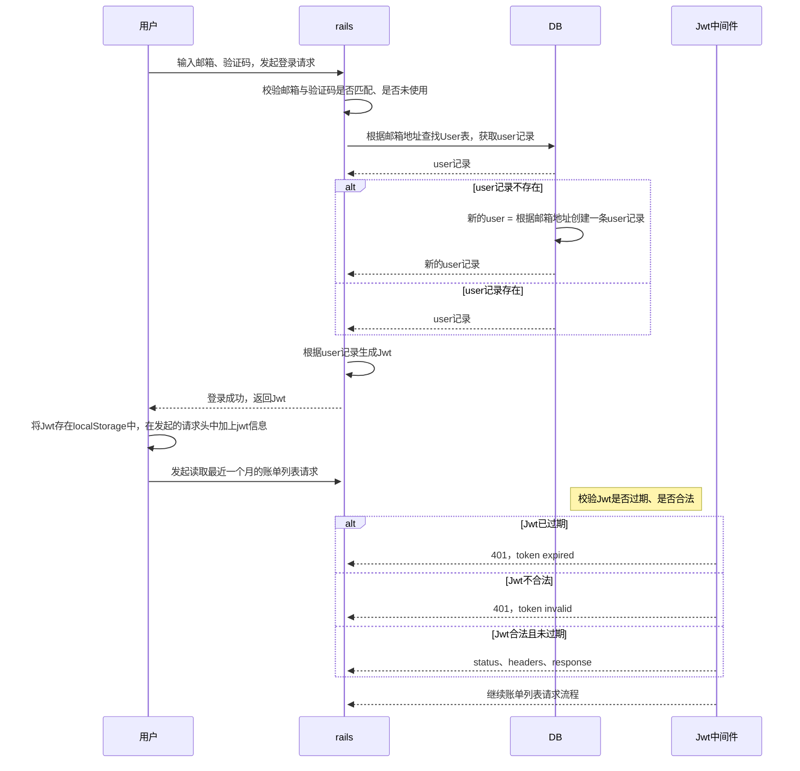

### JWT

定义：JWT(JSON Web Token)是一种开放标准（RFC 7519），用于在各个系统之间安全传输信息的紧凑且自包含的方式。它基于JSON格式，并使用数字签名或加密来验证和保护传输的信息

存储：在客户端存储，通常存储在浏览器的本地存储，如`localStorage`、`cookie`中；

状态管理：无状态；

传输方式：在每个请求中作为请求头或参数直接传输，因此可以跨域传输，适用于分布式系统和API；

扩展性：常用于分布式系统和API身份验证。可以在不同的服务之间传递。相较于session应用更广。

由三部分组成，header、payload、signature；

1. header

```header{"alg": "HS256",
{
  "alg": "HS256",
  "typ": "JWT"
}
```
2. payload

```header{"alg": "HS256",
{
  "userId": "abc123",
  "amount": "100"
}
```
3. signature（密文）

   

   创建格式如下：

``````
const token = base64urlEncoding(header) + '.' + base64urlEncoding(payload) + '.' + base64urlEncoding(signature)
``````


### Session

定义：会话是一种服务器端的存储机制，用于跟踪和管理用户状态。它通过在服务器端存储用户信息和状态来维持用户的会话，并使用会话标识符（session ID）将用户的请求与其相关联。

存储：在服务器的内存、数据库或缓存中；

状态管理：有状态，服务器需要在后端存储和管理会话状态；

传输方式：通过会话标识符（session ID）在每个请求中传输，通常使用cookie或URL参数传递，并且受限于同一域名下的限制；

扩展性：会话适用于基于浏览器的Web应用程序，特别是需要跟踪用户状态和权限管理的应用程序。


### 用户操作时序图




