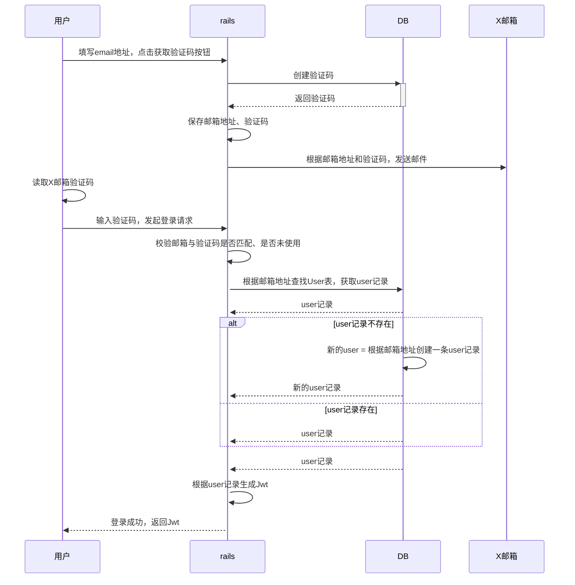

### 邮箱和验证码的登录时序图

```mermaid
    sequenceDiagram
        用户 ->> rails : 填写email地址，点击获取验证码按钮
        rails ->> + DB : 创建验证码
        DB -->> - rails : 返回验证码
        rails ->> rails : 保存邮箱地址、验证码
        rails ->> X邮箱 : 根据邮箱地址和验证码，发送邮件
        用户 ->> 用户 : 读取X邮箱验证码
        用户 ->> rails : 输入验证码，发起登录请求
        rails ->> + rails : 校验邮箱与验证码是否匹配、是否未使用
        rails ->> DB : 根据邮箱地址查找User表，获取user记录
        DB -->> rails : user记录
        alt user记录不存在
            DB ->> DB : 新的user = 根据邮箱地址创建一条user记录
            DB -->> rails : 新的user记录
        else user记录存在
            DB -->> rails : user记录
        end
        DB -->> rails : user记录
        rails ->> rails : 根据user记录生成Jwt
        rails -->> 用户 : 登录成功，返回Jwt
        
        
```

